# Kerberos THM Path (Osint+Malware)

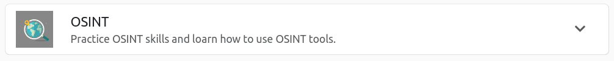

 # [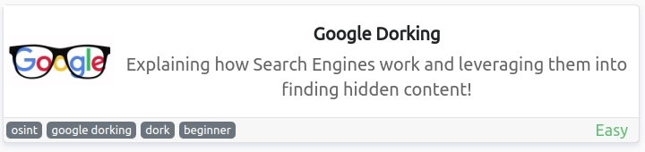](https://tryhackme.com/room/googledorking)     - Room-1
 # [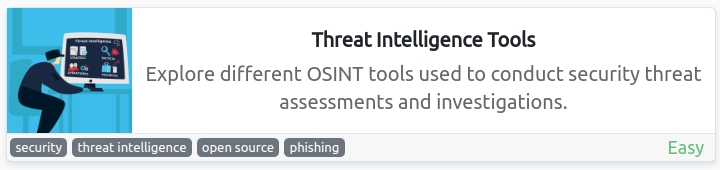](https://tryhackme.com/room/threatinteltools)  - Room-2
 #             - Room-3
 # [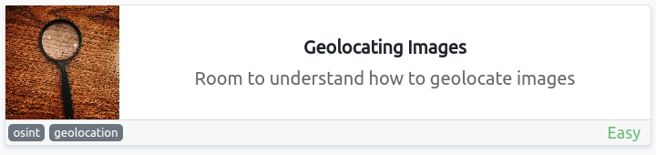](https://tryhackme.com/room/geolocatingimages) - Room-4
 # [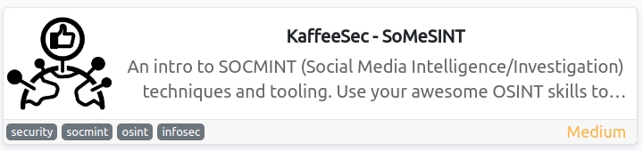](https://tryhackme.com/room/somesint)          - Room-5
 # [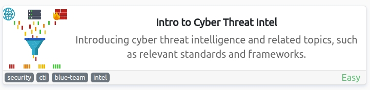](https://tryhackme.com/room/cyberthreatintel)  - Room-6
 #  
 #  
 #   `OSINT CTFs`
  
  
 
 # [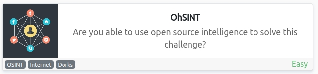](https://tryhackme.com/room/ohsint)            - CTF-1
 # [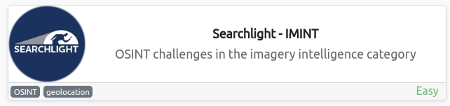](https://tryhackme.com/room/searchlightosint)  - CTF-2

   # .
   # .
   

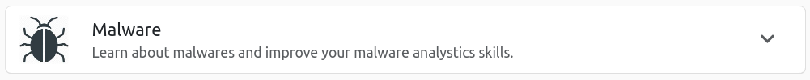

 #        - Room-1
 # [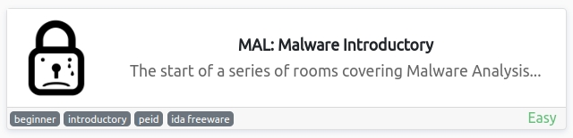](https://tryhackme.com/room/malmalintroductory)       - Room-2
 # [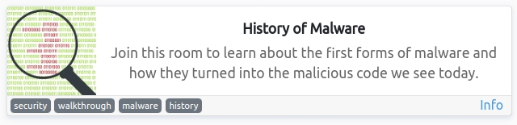](https://tryhackme.com/room/historyofmalware)         - Room-3
 # [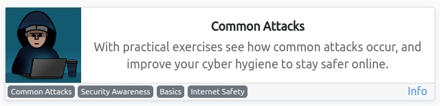](https://tryhackme.com/room/commonattacks)            - Room-4
 # [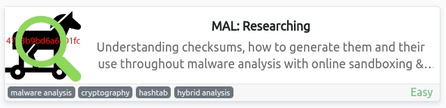](https://tryhackme.com/room/malresearching)           - Room-5
 # [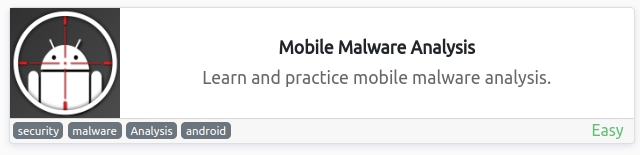](https://tryhackme.com/room/mma)                      - Room-6
 # [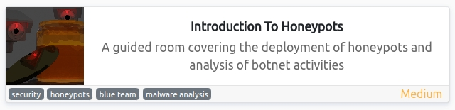](https://tryhackme.com/room/introductiontohoneypots)  - Room-7
 # [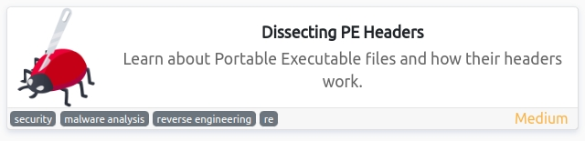](https://tryhackme.com/room/dissectingpeheaders)      - Room-8
 # [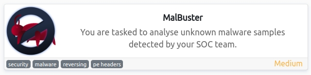](https://tryhackme.com/room/malbuster)                - Room-9
